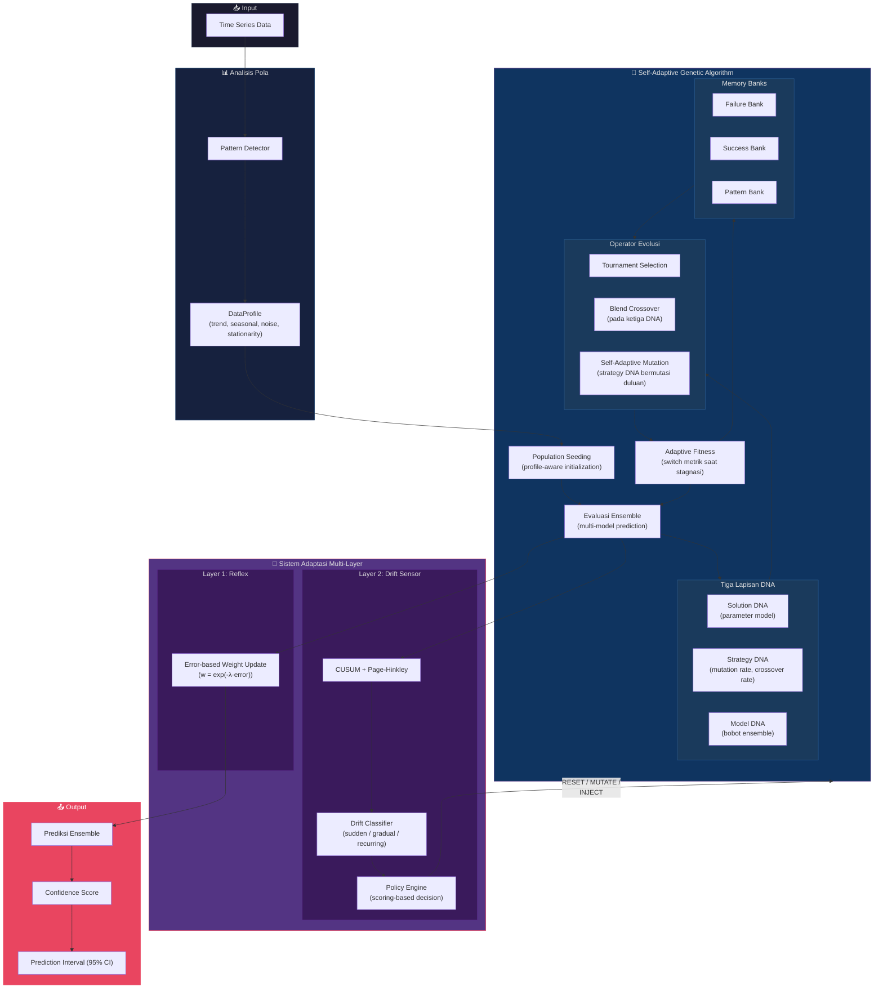

# 🧬 Adaptive Forecasting Engine

> Sistem peramalan time series dengan **Self-Adaptive Genetic Algorithm** yang mampu mengoptimalkan bukan hanya parameter model, tetapi juga **strategi evolusinya sendiri** melalui mekanisme meta-evolution.

---

## 📖 Catatan Penelitian

### 1. Latar Belakang Masalah

Genetic Algorithm (GA) konvensional pada umumnya mengoptimalkan parameter model (α, β, γ) dengan konfigurasi tetap:
- Fitness function statis
- Mutation rate konstan
- Crossover rate konstan
- Berhenti saat konvergen

Permasalahan muncul ketika data mengalami **concept drift** — perubahan distribusi statistik pada data seiring waktu. GA statis tidak memiliki mekanisme untuk mendeteksi maupun merespon perubahan tersebut secara mandiri.

**Pertanyaan riset:** Bagaimana membangun sistem yang mampu secara otonom mendeteksi perubahan lingkungan dan menyesuaikan strategi optimasinya sendiri?

### 2. Pendekatan: Meta-Evolution

Pendekatan yang digunakan adalah **Self-Adaptive Evolutionary Strategy**, di mana bukan hanya solusi yang berevolusi, melainkan **mekanisme evolusinya sendiri ikut berevolusi** secara bersamaan.

Setiap individu dalam populasi membawa tiga lapisan representasi:

| Lapisan | Isi | Sifat |
|---------|-----|-------|
| **Solution DNA** | Parameter model (α, β, γ, p, d, q) | Di-optimasi oleh GA |
| **Strategy DNA** | Mutation rate, crossover rate, step size | **Ikut berevolusi** bersama solusi |
| **Model DNA** | Bobot ensemble antar model | **Ikut berevolusi** bersama solusi |

Individu dengan strategy DNA yang menghasilkan fitness lebih baik akan lolos seleksi → sistem secara otomatis **mempelajari strategi evolusi yang paling efektif** untuk kondisi data tertentu.

### 3. Arsitektur Adaptasi Multi-Layer

Sistem adaptasi dirancang dalam tiga lapisan dengan kecepatan respon berbeda:

| Layer | Kecepatan | Mekanisme | Fungsi |
|-------|-----------|-----------|--------|
| **Reflex** | Instan | Pembaruan bobot berbasis error (`w = exp(-λ·error)`) | Respon langsung terhadap error prediksi |
| **Drift Sensor** | Menengah | CUSUM + Page-Hinkley → Klasifikasi → Policy | Mendeteksi dan merespon perubahan distribusi data |
| **GA Strategist** | Lambat/Strategis | Meta-evolution + Memory + Adaptive Fitness | Optimasi jangka panjang dan pembelajaran strategis |

### 4. Data-Driven Signal vs Rule-Based

Pendekatan konvensional menggunakan aturan statis:
```
if trend_tinggi: gunakan Holt-Winters
if seasonal_rendah: matikan komponen seasonal
```

Pendekatan yang digunakan dalam sistem ini:
- Menghitung **signal kuantitatif** (trend strength, seasonal strength, noise level) melalui dekomposisi statistik
- Signal berfungsi sebagai **input** ke GA, bukan sebagai aturan keputusan
- GA mempelajari sendiri mapping optimal antara signal dan konfigurasi parameter
- Policy engine menggunakan **scoring-based decisions** dengan context modifiers

### 5. Adaptive Fitness Function

Pada GA konvensional, fungsi fitness bersifat tetap (misalnya MSE). Pada sistem ini, fitness function **beradaptasi secara dinamis**:

| Kondisi | Respons Fitness |
|---------|-----------------|
| Normal | MSE sebagai metrik utama |
| Stagnasi (tidak ada perbaikan) | Beralih ke MAE (landscape error berbeda) |
| Overfitting terdeteksi | Menambahkan regularisation penalty |
| Diversity collapse | Menambahkan diversity bonus |

Mekanisme ini memungkinkan GA untuk keluar dari local optima dan mempertahankan eksplorasi ruang solusi.

### 6. Memory System

GA dilengkapi dengan sistem memori tiga bank untuk pembelajaran historis:

- **Failure Bank** — Menyimpan region parameter yang konsisten menghasilkan fitness buruk → dihindari melalui penalty
- **Success Bank** — Menyimpan elite solutions dari eksekusi sebelumnya → direintroduksi saat populasi membutuhkan injeksi kualitas
- **Pattern Bank** — Memetakan DataProfile ke Strategy DNA → memungkinkan warm-start pada data dengan karakteristik serupa di masa mendatang

### 7. Drift Detection & Classification

Sistem tidak hanya mendeteksi keberadaan drift, tetapi juga **mengklasifikasikan jenis drift**:

| Jenis Drift | Karakteristik | Respons |
|-------------|---------------|---------|
| **Sudden** | Perubahan distribusi mendadak | Full/Partial population reset |
| **Gradual** | Pergeseran bertahap | Peningkatan mutation rate |
| **Recurring** | Pola yang berulang periodik | Injeksi diversitas dari memory bank |
| **Incremental** | Perubahan kecil kumulatif | Peningkatan mutation rate secara gentle |

Respons ditentukan melalui **scoring system** dengan context modifiers (magnitude, diversity, stagnation count, frekuensi drift).

---

## 📐 Diagram Alur Penelitian



---

## 🏗️ Struktur Proyek

```
adaptive_forecasting/
│
├── main.py                          # CLI entry point
├── requirements.txt
│
├── config/
│   ├── settings.py                  # Konstanta global & default
│   └── model_config.yaml            # Batas parameter model
│
├── data/
│   ├── raw/
│   ├── processed/
│   └── loaders.py                   # CSV loader + generator sintetis
│
├── models/
│   ├── base_model.py                # Abstract base class
│   ├── holt_winters.py              # Additive + Multiplicative
│   ├── arima.py                     # ARIMA(p,d,q) pure numpy
│   ├── lstm.py                      # Minimal LSTM (pure numpy)
│   └── registry.py                  # Model registry (scalable)
│
├── patterns/
│   ├── detector.py                  # Deteksi trend, seasonal, noise
│   └── profile.py                   # DataProfile dataclass
│
├── adaptation/
│   ├── reflex.py                    # Layer 1 — pembaruan bobot instan
│   ├── drift_detection.py           # CUSUM + Page-Hinkley
│   ├── drift_classification.py      # Klasifikasi jenis drift
│   ├── policy.py                    # Decision engine (scoring-based)
│   └── weighting.py                 # Pengelolaan bobot ensemble
│
├── genetic/
│   ├── chromosome.py                # Encoding/decoding gen
│   ├── individual.py                # Tiga lapisan DNA
│   ├── population.py                # Inisialisasi profile-aware
│   ├── operators.py                 # Crossover + Mutation (meta-evolving)
│   ├── fitness.py                   # Adaptive fitness controller
│   ├── memory.py                    # Failure/Success/Pattern banks
│   └── ga_engine.py                 # GA engine core loop
│
├── evaluation/
│   ├── metrics.py                   # MSE, MAE, RMSE, MAPE, sMAPE, R²
│   ├── uncertainty.py               # Confidence scoring + interval
│   └── validator.py                 # Walk-forward validation
│
├── pipeline/
│   ├── orchestrator.py              # Main orchestrator loop
│   ├── trainer.py                   # Batch training pipeline
│   └── online_loop.py              # Streaming mode
│
├── experiments/
│   └── exp_001_baseline.py          # Eksperimen baseline
│
├── utils/
│   ├── helpers.py                   # Normalisasi, softmax, split, dsb.
│   └── logger.py                    # Logging berwarna + EvolutionLogger
│
└── frontend/                        # Web dashboard (React + Vite)
    └── src/
```

---

## 🚀 Quick Start

### Backend (Forecasting Engine)

```bash
# Install dependencies
pip install numpy matplotlib pyyaml

# Demo dengan data seasonal
python3 main.py --demo seasonal

# Demo dengan regime change (uji drift detection)
python3 main.py --demo regime_change

# Data custom
python3 main.py --data your_data.csv --horizon 12

# Dengan visualisasi
python3 main.py --demo seasonal --plot

# Semua opsi
python3 main.py --help
```

### Opsi CLI

| Flag | Default | Deskripsi |
|------|---------|-----------|
| `--data` | — | Path ke CSV file |
| `--demo` | `seasonal` | Tipe data sintetis |
| `--horizon` | `12` | Langkah prediksi ke depan |
| `--generations` | `80` | Maksimum generasi GA |
| `--population` | `40` | Ukuran populasi GA |
| `--length` | `200` | Panjang data sintetis |
| `--noise` | `0.1` | Level noise |
| `--plot` | — | Tampilkan plot matplotlib |

---

## 📊 Hasil Verifikasi

### Akurasi Pattern Detection

| Tipe Data | Trend | Seasonal | Noise | Period |
|-----------|-------|----------|-------|--------|
| stable | 0.01 ✅ | 0.11 | **0.70** ✅ | — |
| trending | **0.99** ✅ | 0.00 | 0.01 | — |
| seasonal | 0.73 | **0.94** ✅ | 0.00 | **12** ✅ |
| chaotic | 0.00 ✅ | 0.76 | 0.25 | — |
| regime_change | 0.79 | 0.81 | 0.21 | — |

### End-to-End Test (Seasonal, n=120)

```
📊 Data Profile: trend=0.45 | season(T=12)=0.90
🧬 Best: HoltWinters (90%), mut=0.422
📈 Val RMSE: 2.52
🔮 12-step forecast with 95% CI
   Confidence: 64.65%
```

- Fitness GA: `0.143 → 0.089` (peningkatan 38%, 30 generasi)
- Mutation rate teradaptasi secara mandiri: acak → 0.42
- Runtime: ~3 detik

---

## 🔬 Perbandingan: GA Konvensional vs Self-Adaptive GA

```
GA Konvensional:
  Individual = [alpha, beta, gamma]
  mutation_rate = 0.1 (TETAP)
  fitness = MSE (TETAP)

Self-Adaptive GA:
  Individual = {
    solution: [alpha, beta, gamma, p, d, q, ...],
    strategy: [mutation_rate, crossover_rate, step_size],  ← IKUT EVOLVE
    model:    [hw_weight, arima_weight]                    ← IKUT EVOLVE
  }
  fitness = ADAPTIF (beralih saat stagnasi)
  memory  = BELAJAR dari keberhasilan/kegagalan sebelumnya
```

---

## 📝 Catatan Teknis

- **LSTM** dipisahkan dari default registry karena overhead komputasi yang tinggi saat evaluasi populasi GA. Gunakan `build_full_registry()` untuk menyertakan LSTM pada tahap final training.
- Semua model diimplementasikan menggunakan **pure numpy** tanpa dependensi eksternal berat (statsmodels, torch).
- Pattern detector menggunakan **R² untuk trend**, **autocorrelation untuk seasonal**, dan **residual variance ratio untuk noise**.
- Drift detector mengkombinasikan **CUSUM** (pergeseran mendadak) dan **Page-Hinkley** (pergeseran bertahap).
- Walk-forward validation tersedia di `evaluation/validator.py` untuk evaluasi temporal yang lebih robust.

---

---

## 🚀 Deployment (Frontend + Backend Separated)

The frontend and backend can be deployed independently to separate hosting providers (e.g. Vercel). The sections below explain how to configure each side correctly.

### How API calls work

| Environment | Behaviour |
|-------------|-----------|
| **Development** (`vite dev`) | Requests to `/api/*` are proxied by Vite to `http://localhost:8000`. `VITE_API_URL` does not need to be set. |
| **Production** (static build) | The Vite proxy is **not available**. The frontend must know the backend's public URL at build time via the `VITE_API_URL` environment variable. |

### Step-by-step: deploying on Vercel

#### Backend

1. Create a new Vercel project pointing at the repository root (or the backend directory).
2. Ensure your backend framework (FastAPI) is configured to allow CORS from the frontend origin:
   ```python
   from fastapi.middleware.cors import CORSMiddleware

   app.add_middleware(
       CORSMiddleware,
       allow_origins=["https://adaptive-forecasting.vercel.app"],
       allow_methods=["*"],
       allow_headers=["*"],
   )
   ```
3. Deploy the backend. Note the deployment URL (e.g. `https://adaptive-forecasting-backend.vercel.app`).

#### Frontend

1. Create a separate Vercel project pointing at the `frontend/` directory.
2. In **Vercel → Project Settings → Environment Variables**, add:

   | Name | Value | Environments |
   |------|-------|--------------|
   | `VITE_API_URL` | `https://adaptive-forecasting-backend.vercel.app` | Production, Preview |

3. Trigger a new deployment (or redeploy). Vercel will run `npm run build` with the variable embedded, so the frontend bundle will call the correct backend URL.

> **Important:** `VITE_API_URL` is a *build-time* variable — it is compiled into the static bundle by Vite. You must **redeploy** the frontend whenever the backend URL changes.

#### Local development

```bash
# No .env file is required — the Vite proxy handles /api/* automatically.
cd frontend
npm install
npm run dev          # proxies /api/* → http://localhost:8000
```

If you want to point your local frontend at the production backend, create `frontend/.env.local`:

```bash
# frontend/.env.local
VITE_API_URL=https://adaptive-forecasting-backend.vercel.app
```

Then restart `npm run dev`.

---

## 📌 Roadmap

- [x] Core engine (GA + Models + Adaptation)
- [x] Pattern detection & data profiling
- [x] Memory system (failure/success/pattern banks)
- [x] CLI entry point
- [ ] Frontend dashboard (React + Vite + shadcn/ui)
- [ ] Real-time streaming visualization
- [ ] Multi-environment training experiments
- [ ] Export trained models
