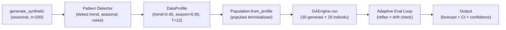
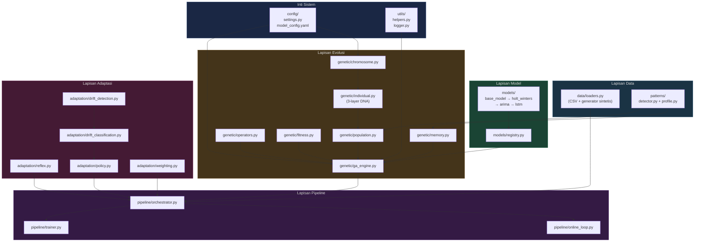
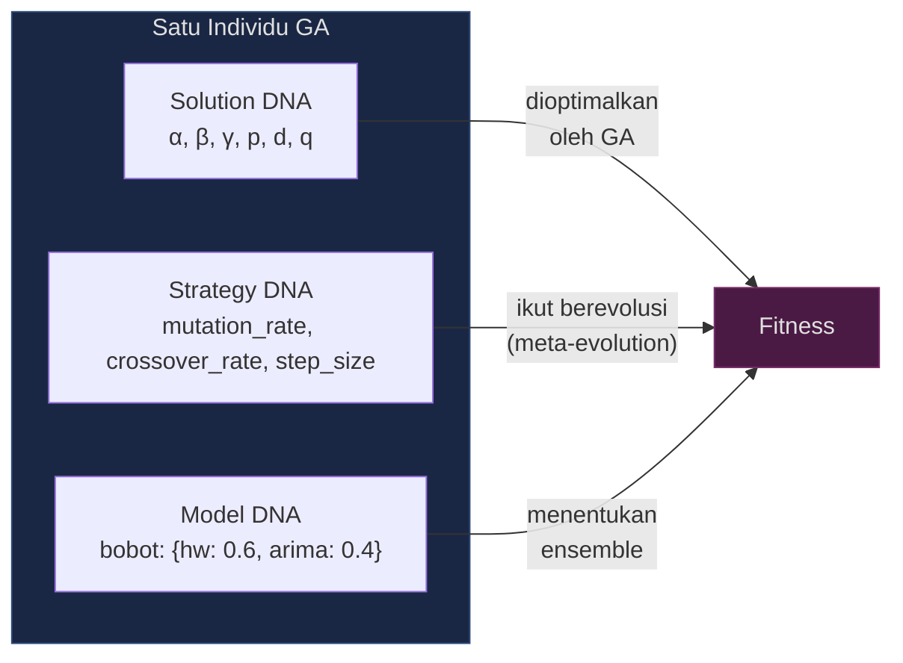
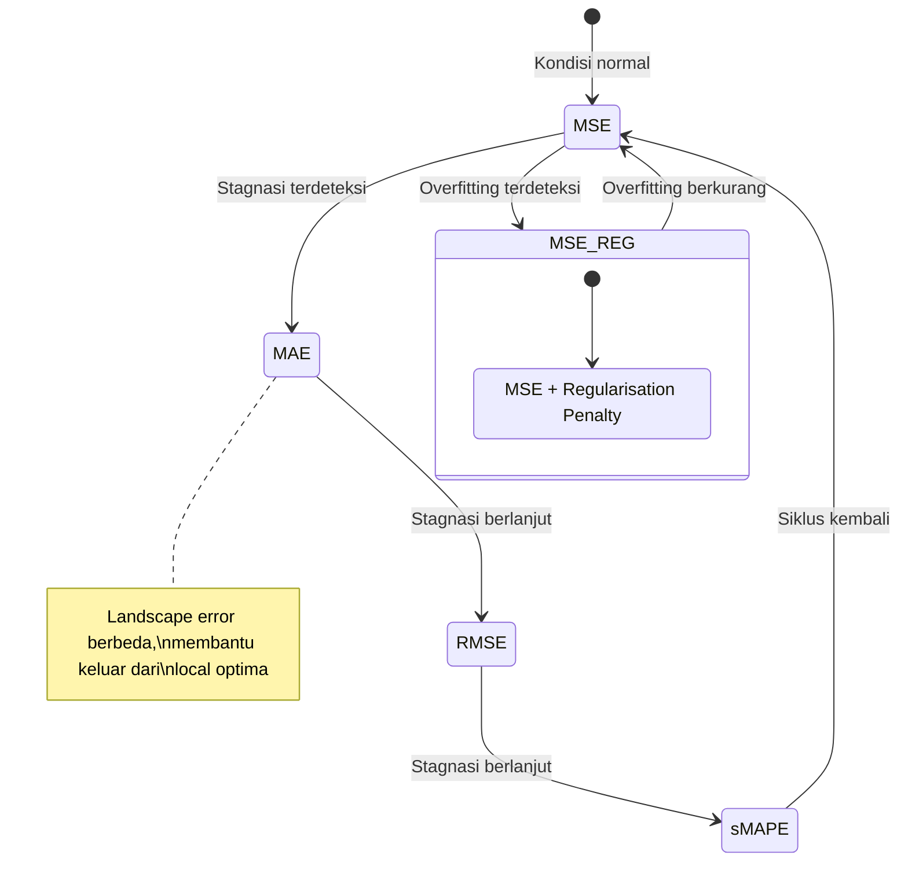
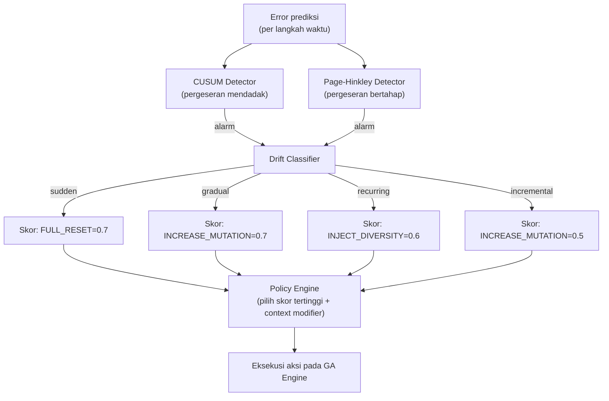

# Walkthrough — Adaptive Forecasting Engine

Dokumen ini berfungsi sebagai panduan onboarding bagi pengguna dan pengembang baru. Tujuannya adalah memberikan pemahaman menyeluruh mengenai alur kerja sistem, cara penggunaan, serta panduan untuk mengembangkan komponen baru.

---

## 1. Gambaran Umum Sistem

Adaptive Forecasting Engine adalah sistem peramalan time series yang menggunakan **Self-Adaptive Genetic Algorithm**. Sistem ini memiliki kemampuan untuk mengoptimalkan parameter model dan secara simultan **mengadaptasi strategi evolusinya sendiri** (meta-evolution) berdasarkan karakteristik data dan umpan balik kinerja.

### Diagram Alur Kerja

```mermaid
sequenceDiagram
    participant U as Pengguna
    participant M as Main CLI
    participant O as Orchestrator
    participant PD as Pattern Detector
    participant GA as GA Engine
    participant AD as Adaptation Layer
    participant OUT as Output

    U->>M: Input data (CSV / sintetis)
    M->>O: Inisialisasi pipeline

    rect rgb(30, 40, 60)
        Note over O,PD: Tahap 1 — Analisis Pola
        O->>PD: Kirim time series
        PD-->>O: DataProfile (trend, seasonal, noise)
    end

    rect rgb(40, 30, 60)
        Note over O,GA: Tahap 2 — Evolusi GA
        O->>GA: Buat populasi (profile-aware)
        loop Setiap Generasi
            GA->>GA: Evaluasi ensemble prediction
            GA->>GA: Seleksi + Crossover + Mutasi (meta-evolving)
            GA->>GA: Update adaptive fitness
            GA->>GA: Update memory banks
        end
        GA-->>O: Individu terbaik (parameter + strategi + bobot)
    end

    rect rgb(60, 30, 50)
        Note over O,AD: Tahap 3 — Evaluasi Adaptif
        loop Setiap Langkah Validasi
            O->>AD: Error prediksi terbaru
            AD->>AD: Layer 1 — Reflex (update bobot instan)
            AD->>AD: Layer 2 — Drift Detection (CUSUM + PH)
            alt Drift terdeteksi
                AD->>GA: Trigger adaptasi (RESET / MUTATE / INJECT)
            end
            AD-->>O: Prediksi ensemble + confidence
        end
    end

    O->>OUT: Forecast + Prediction Interval
    OUT-->>U: Hasil prediksi + visualisasi
```



---

## 2. Demo Alur Kerja: Data Loading → Prediksi

### 2.1 Menjalankan dengan Data Sintetis

```bash
python3 main.py --demo seasonal --generations 30 --population 20
```

Perintah ini menjalankan keseluruhan pipeline:



### 2.2 Menjalankan dengan Data CSV

```bash
python3 main.py --data data/raw/your_data.csv --horizon 12 --plot
```

Sistem akan secara otomatis:
1. Memuat kolom numerik pertama dari CSV
2. Menganalisis pola data (trend, seasonal, noise)
3. Menjalankan GA dengan populasi yang disesuaikan terhadap profil data
4. Menghasilkan prediksi `--horizon` langkah ke depan

### 2.3 Mode Streaming (Online Loop)

```python
from pipeline.online_loop import OnlineLoop
import numpy as np

loop = OnlineLoop()
loop.initialise(initial_data=np.array([...]))  # data historis

# Setiap kali data baru masuk:
result = loop.step(new_value=42.5)
print(result["prediction"])    # prediksi langkah berikutnya
print(result["confidence"])    # skor kepercayaan (0..1)
print(result["drift_detected"])  # apakah drift terdeteksi?
```

---

## 3. Peta Navigasi Modul

Diagram berikut menunjukkan hubungan dependensi antar modul utama:



---

## 4. Tutorial: Menambahkan Model Baru ke Registry

Berikut langkah-langkah untuk mengintegrasikan model peramalan baru ke dalam sistem.

### 4.1 Buat Kelas Model

Buat file baru di `models/`, misalnya `models/exponential_smoothing.py`:

```python
import numpy as np
from models.base_model import BaseModel

class ExponentialSmoothing(BaseModel):

    def __init__(self, alpha: float = 0.3):
        super().__init__(name="exp_smoothing")
        self.alpha = alpha
        self._last_level = 0.0

    def get_params(self) -> dict:
        return {"alpha": self.alpha}

    def set_params(self, params: dict) -> None:
        if "alpha" in params:
            self.alpha = float(np.clip(params["alpha"], 0.01, 0.99))
        self._fitted = False

    def fit(self, train_data: np.ndarray) -> "ExponentialSmoothing":
        data = np.asarray(train_data, dtype=np.float64)
        level = data[0]
        for val in data[1:]:
            level = self.alpha * val + (1 - self.alpha) * level
        self._last_level = level
        self._fitted = True
        return self

    def forecast(self, horizon: int) -> np.ndarray:
        if not self._fitted:
            raise RuntimeError("Model belum dilatih. Panggil fit() terlebih dahulu.")
        return np.full(horizon, self._last_level)
```

### 4.2 Tambahkan Gene Definition

Di `genetic/chromosome.py`, tambahkan definisi gen untuk parameter model baru:

```python
GENE_DEFS = {
    # ... gen yang sudah ada ...
    "es_alpha": {"min": 0.01, "max": 0.99, "type": "float"},
}
```

Kemudian tambahkan fungsi `encode_params` dan `decode_params` untuk model baru.

### 4.3 Daftarkan ke Registry

Di `models/registry.py`, tambahkan registrasi:

```python
def build_default_registry() -> ModelRegistry:
    from models.holt_winters import HoltWinters
    from models.arima import ARIMA
    from models.exponential_smoothing import ExponentialSmoothing  # baru

    registry = ModelRegistry()
    registry.register("holt_winters", HoltWinters)
    registry.register("arima", ARIMA)
    registry.register("exp_smoothing", ExponentialSmoothing)        # baru
    return registry
```

### 4.4 Tambahkan Bobot di Individual

Di `genetic/individual.py`, tambahkan bobot awal:

```python
self.model_weights = {
    "holt_winters": 0.5,
    "arima": 0.3,
    "exp_smoothing": 0.2,  # baru
}
```

Setelah langkah-langkah di atas, model baru akan **secara otomatis** ikut dalam proses evolusi GA, evaluasi ensemble, dan pembaruan bobot adaptif.

---

## 5. Tutorial: Batch Training via API

```python
from pipeline.trainer import Trainer
from data.loaders import generate_synthetic

# Siapkan data
data = generate_synthetic("seasonal", length=200, seed=42)

# Jalankan training
trainer = Trainer()
result = trainer.train(
    data,
    max_generations=50,
    population_size=30,
    val_ratio=0.2,
)

# Akses hasil
best = result["best_individual"]
print(f"Individu terbaik: {best}")
print(f"Profil data: {result['profile'].summary()}")
print(f"Prediksi validasi: {result['predictions'][:5]}")
```

---

## 6. Konsep Kunci yang Perlu Dipahami

### 6.1 Tiga Lapisan DNA pada Setiap Individu



**Mengapa penting?** Individu dengan strategy DNA yang buruk (misalnya mutation rate terlalu rendah) akan menghasilkan offspring yang kurang variatif → cenderung terseleksi keluar. Strategy DNA yang baik akan terakumulasi secara alami dalam populasi.

### 6.2 Siklus Adaptive Fitness



### 6.3 Mekanisme Drift Detection



---

## 7. Hasil Verifikasi

### 7.1 Uji End-to-End (Data Seasonal, n=120)

```
📊 Data Profile : trend=0.45 | season(T=12)=0.90
🧬 Model terbaik: HoltWinters (90%), mutation rate=0.422
📈 Val RMSE     : 2.52
🔮 Forecast     : 12 langkah ke depan dengan 95% CI
   Confidence   : 64.65%
```

### 7.2 Evolusi GA (30 generasi, 20 individu)

| Metrik | Awal | Akhir | Perubahan |
|--------|------|-------|-----------|
| Best fitness | 0.143 | 0.089 | -38% |
| Mutation rate (rerata) | Acak | 0.42 | Terkonvergen mandiri |
| Runtime | — | ~3 detik | — |

### 7.3 Akurasi Pattern Detection

| Tipe Data | Trend | Seasonal | Noise | Period |
|-----------|-------|----------|-------|--------|
| stable | 0.01 ✅ | 0.11 | **0.70** ✅ | — |
| trending | **0.99** ✅ | 0.00 | 0.01 | — |
| seasonal | 0.73 | **0.94** ✅ | 0.00 | **12** ✅ |
| chaotic | 0.00 ✅ | 0.76 | 0.25 | — |
| regime_change | 0.79 | 0.81 | 0.21 | — |

---

## 8. Daftar File yang Diimplementasikan

| Paket | File | Fungsi |
|-------|------|--------|
| `config/` | `settings.py`, `model_config.yaml` | Konfigurasi terpusat |
| `data/` | `loaders.py` | Pemuat CSV + generator data sintetis |
| `utils/` | `helpers.py`, `logger.py` | Utilitas umum + logging berwarna |
| `evaluation/` | `metrics.py`, `uncertainty.py`, `validator.py` | Metrik evaluasi + estimasi ketidakpastian |
| `models/` | `base_model.py`, `holt_winters.py`, `arima.py`, `lstm.py`, `registry.py` | Model peramalan + registri |
| `patterns/` | `profile.py`, `detector.py` | Deteksi pola data |
| `genetic/` | `chromosome.py`, `individual.py`, `population.py`, `operators.py`, `fitness.py`, `memory.py`, `ga_engine.py` | Inti Self-Adaptive GA |
| `adaptation/` | `reflex.py`, `drift_detection.py`, `drift_classification.py`, `weighting.py`, `policy.py` | Sistem adaptasi multi-layer |
| `pipeline/` | `orchestrator.py`, `trainer.py`, `online_loop.py` | Integrasi pipeline |
| Root | `main.py` | Titik masuk CLI |
